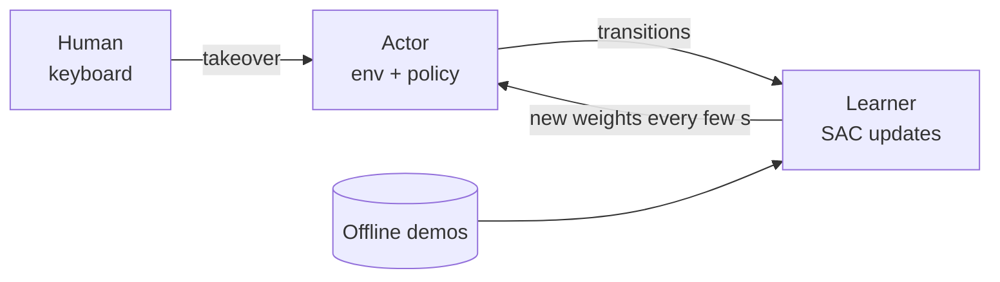

# TP: Interactive Robot Learning with HIL-SERL

**Duration:** 4 hours · **Groups of 2:** one *operator* at the controls, one *observer* who times, counts and takes notes. Swap roles between parts.

In this lab you train a simulated Franka Panda arm to pick up a cube with reinforcement learning, while you stay in the loop and take control when it goes wrong. You then measure how much your interventions speed up learning compared to RL alone.

The lab uses LeRobot's HIL-SERL implementation (Human-in-the-Loop Sample-Efficient RL, Luo et al. 2024) and the `gym_hil` MuJoCo environment. No real robot is needed.

**Learning objectives.** By the end of the lab you should be able to:

1. Explain what makes robot learning *interactive*, and place HIL-SERL among related methods (behavioural cloning, DAgger/HG-DAgger, TAMER, RLHF).
2. Describe the actor–learner architecture and why an off-policy algorithm (SAC) can learn from demonstrations, its own rollouts and human corrections at the same time.
3. Collect demonstrations and give corrective interventions with the keyboard.
4. Run a controlled comparison (with vs. without human interventions) and read learning curves: episodic reward and intervention rate.
5. Reflect on the cost of human effort and on what a good intervention strategy looks like.

**Prerequisites.** Basic Python and Linux shell; notions of RL (MDP, reward, policy, Q-function).

**Deliverable.** Fill in [`answers.md`](answers.md) with your answers, tables and figures (from `runs/plots/`), export it to PDF, and hand it in one week after the session. You hand in through your own GitHub repository: see [Hand-in on GitHub](#hand-in-on-github).

---

## Schedule

| Time | Duration | Part | What you do |
| --- | --- | --- | --- |
| 0:00 | 15 min | Setup | Check the machine, controls, W&B |
| 0:15 | 30 min | Part 1 | Explore the environment, teleoperate |
| 0:45 | 20 min | Part 2 | Record 10 demonstrations |
| 1:05 | 35 min | Part 3 | RL run **without** interventions (answer theory questions while it runs) |
| 1:40 | 10 min | Break | |
| 1:50 | 40 min | Part 4 | HIL-SERL run **with** interventions |
| 2:30 | 45 min | Part 5 | One controlled experiment |
| 3:15 | 30 min | Part 6 | Class comparison and discussion |
| 3:45 | 15 min | Wrap-up | Save your `runs/` folder and `answers.md` |

---

## Background

Robot learning is *interactive* when a teacher responds to the robot's own behaviour **during** learning, rather than handing over a fixed dataset beforehand. The teacher's input depends on what the learner just did.

| Method | Teacher gives | When | Interactive? |
| --- | --- | --- | --- |
| Behavioural cloning | Demonstrations | Before training | No |
| DAgger / HG-DAgger | Corrective actions on the learner's states | Between or during rollouts | Yes |
| TAMER / COACH | Scalar good/bad feedback | During rollouts | Yes |
| Preference learning / RLHF | Comparisons between rollouts | Between rounds | Yes |
| **HIL-SERL** | Demos + takeovers during RL | Before and during training | Yes |

**HIL-SERL in three ingredients.**

1. **Offline demonstrations.** A few teleoperated episodes seed the replay buffer, so the agent starts from something that works.
2. **Online RL with human takeovers.** The policy explores; at any moment you can override it for as many steps as you want. The robot then executes *your* action instead of the policy's, and that transition is stored and learned from.
3. **A reward signal.** On a real robot this is usually a learned success classifier. In `gym_hil` the simulator knows when the cube is lifted, so it gives the reward directly.

**Actor–learner architecture.** Two processes run in parallel and talk over gRPC:



The learner samples batches that mix offline demos and online experience (`"mixer": "online_offline"`, `"online_ratio": 0.5`). This works because **SAC is off-policy**: it can learn from transitions it did not generate itself, whether they come from demos, from its own exploration or from you.

**Key reading.** Luo, Xu, Wu & Levine, *Precise and Dexterous Robotic Manipulation via Human-in-the-Loop Reinforcement Learning*, [arXiv:2410.21845](https://arxiv.org/abs/2410.21845) (2024). Kelly et al., *HG-DAgger*, [arXiv:1810.02890](https://arxiv.org/abs/1810.02890) (2019).

---

## Setup (15 min)

Open a terminal **inside the desktop session** of the lab machine (not over SSH). Every command in this TP is run from the root of the repository.

```bash
cd tp-hil-serl
conda activate tp-hil
export TP_GROUP=group07        # <-- your group name; set it in every new terminal
python check_setup.py          # no line should be FAIL
wandb login                    # paste your W&B API key once
```

`check_setup.py` auto-detects your compute device (NVIDIA CUDA, Apple MPS, or CPU) and every run is configured for it automatically — the commands below are the same on Linux, macOS and Windows. On MPS or CPU, training (Parts 3-5) is slower than the schedule below assumes; that's expected, not a mistake. Write down your device (`cuda` / `mps` / `cpu`, plus GPU model if any) at the top of `answers.md` — Part 6 compares runs across the whole class, and device is a confound you'll need to account for.

**Controls.** The robot is driven from the keyboard in end-effector space: you move the gripper in x, y, z and open/close it.

| Action | Key |
| --- | --- |
| Move in x–y plane | Arrow keys |
| Move up / down (z) | U / D (tap for one step, hold to keep moving) |
| Grasp | Hold C (the gripper opens when you release it) |
| **Take over from the policy** | **Space** (toggle on/off) |
| End episode: success | V (next to C, so you can keep holding C) or Enter |
| End episode: failure | Esc |
| Re-record episode | X |

Space toggles intervention on, and you press it **again** to hand control back. Keep C held from the moment you grasp until the cube is lifted: releasing it opens the gripper. When you drive the robot yourself (`teleop.py`, `record.py`), lifting the cube does not end the episode: press **V** (or Enter) once it is lifted, still holding C (during training, a lift ends the episode by itself). Episodes still time out after 10 s.

**Driving without a policy (`teleop.py`, `record.py`) uses the same takeover control.** The robot only follows your keys while you are intervening, so press Space at the start of **every** episode: each reset turns intervention off again. The keyboard is read system-wide: keys typed in any window, including your terminal or a chat, still drive the robot (Space toggles control; V, Enter, Esc and X end the episode). Don't type anywhere else while the simulator is running. The MuJoCo window also reacts to letter keys by changing what it displays (D briefly hides the robot base, for example); this is undone automatically and does not affect the robot.

Key settings: control rate 10 Hz, episodes of at most 10 s (100 steps), two cameras (`front`, `wrist`) at 128×128, an 18-dimensional state vector, and a 3-D continuous action (dx, dy, dz) plus a discrete gripper command. The reference configs are in [`configs/`](configs/); the scripts never modify them, they write a copy for each run in `runs/configs/`.

---

## Part 1: Discover the environment (30 min)

Goal: understand what the agent sees, what it controls, and how hard the task is for a human.

**1.1 Inspect the spaces.**

```bash
python scripts/inspect_env.py
```

It prints the observation and action spaces, runs 50 random steps, saves the two camera views to `runs/plots/cameras.png`, and prints the normalisation ranges of the state vector.

**1.2 Teleoperate.**

```bash
python scripts/teleop.py
```

The operator attempts the task **5 times**, ending each attempt with *success* or *failure*. The observer fills in the *human trials* table in `answers.md`: time to success or failure, and what went wrong. The terminal prints `Episode ended after N steps (T s)` for each attempt. Swap roles and repeat. Teleoperation does not stop by itself: press **Ctrl+C** in the terminal to finish.

**Questions**

- **Q1.1** Describe the observation and action spaces. What do you think the 18 values of `observation.state` contain? (Hint: the normalisation ranges printed by `inspect_env.py`.) The script prints two action spaces: the raw simulator's, and the one the agent actually sees after the TP's wrappers (4 values: dx, dy, dz and a gripper command). Describe the second, and say what you think the difference is.
- **Q1.2** The agent acts in end-effector space (dx, dy, dz), not in joint space. Why is this a big simplification for RL? What does the robot need to do internally to execute such an action?
- **Q1.3** When does the environment give a reward, and how much? Is the reward sparse or dense? What problem does that create for an RL agent exploring at random?
- **Q1.4** Report your success rate and mean time to success as human operators. Which phase of the task is hardest (approach, alignment, grasp, lift)?

---

## Part 2: Record demonstrations (20 min)

Goal: build your own small offline dataset. Parts 3 and 4 use the shared reference dataset (30 demos) so all groups are comparable; your own dataset is used in Part 5 (experiment C).

```bash
python scripts/record.py --episodes 10
```

Each episode: grasp and lift the cube, then press **success** (V while still holding C, or Enter). If you mess up, press **re-record** (X) or **failure** (Esc). A successful episode ends with reward 1; a failed or timed-out one with reward 0. Split the 10 episodes between the two group members. At the end the script prints one line per episode (length, final reward). Run `python scripts/record.py --summary-only` to see it again.

**Questions**

- **Q2.1** Why can an off-policy RL algorithm use these demonstrations, while a pure on-policy algorithm (e.g. PPO) could not use them directly?
- **Q2.2** Your demos are not all equally clean. List two properties of a demonstration that would make it more *useful* for RL, and two that would make it harmful.
- **Q2.3** Compare with pure behavioural cloning: what would happen if you trained a policy by supervised learning on only these 10 demos? Relate your answer to covariate shift.

---

## Part 3: RL baseline without interventions (35 min)

Goal: see how fast SAC learns from the 30 reference demos plus its own exploration, with **no** human help. This is your control condition.

**3.1 Prepare the run.**

```bash
python scripts/train.py --run noHIL
```

This writes `runs/configs/<group>_noHIL.json` and prints three commands. Compared to the reference config it only changes the run name, the output folder, the W&B project and the weight-push interval (4 s instead of 50 s, so the actor gets fresh weights).

**3.2 Launch.** Open three terminals (remember `conda activate tp-hil` and `export TP_GROUP=...` in each):

| Terminal | Command | Who |
| --- | --- | --- |
| 1 | the `scripts/lerobot_rl.py learner` command printed above (start it **first**) | — |
| 2 | the `scripts/lerobot_rl.py actor` command (opens the sim window; on macOS it is run with `mjpython`) | operator |
| 3 | `python scripts/log_progress.py --run noHIL` | observer |

**3.3 Let it run for 25 minutes. Do not touch the controls**, except to end an episode if the robot is clearly stuck. In terminal 3 the observer types `f` at the first success, and `s <n>` every 5 minutes with the number of successes among the last 10 episodes. Then stop the actor (Ctrl+C), then the learner.

**Theory questions (answer while the run is going)**

- **Q3.1** In SAC the policy maximises reward *plus* entropy, weighted by a temperature α (`temperature_init = 0.01`). What does α control? What happens if it is too high or too low?
- **Q3.2** `utd_ratio = 2` is the update-to-data ratio. What does it mean, and why do sample-efficient methods push it above 1?
- **Q3.3** The learner pushes new weights to the actor every few seconds. What is the effect of a long delay on the data the actor collects? Is SAC robust to this, and why?
- **Q3.4** The vision encoder (a pretrained ResNet-10) is frozen. Give one advantage and one drawback.
- **Q3.5** The discount is 0.97 and an episode lasts up to 100 steps (10 s). How much is a reward received at the very end of an episode, 100 steps in the future, worth at the start? What does that imply for a sparse, end-of-task reward?

---

## Part 4: HIL-SERL with human interventions (40 min)

Goal: repeat Part 3 in exactly the same conditions, but this time you coach the robot by taking over when it goes wrong. This is the interactive condition.

```bash
python scripts/train.py --run HIL
```

Launch the three terminals as in 3.2 (observer: `python scripts/log_progress.py --run HIL`). Run for **25 minutes**, the same as the baseline.

**How to intervene.** The learning curve is very sensitive to *how* you intervene. Follow this protocol:

1. **First 2–3 episodes: hands off.** Let the policy explore.
2. **Intervene briefly, when the robot goes off track** (moving away from the cube, pushing it, hovering without descending). Take over, bring the gripper back to a good position, and hand back control. Avoid long takeovers.
3. **Once the policy sometimes succeeds**, reduce your help to quick nudges, for example a single grasp command at the right moment.
4. A good run looks like this: many interventions at the start, then fewer and fewer.

**Observer:** in addition to `f` and `s <n>`, log **every** intervention with `i <seconds> <reason>`, e.g. `i 4 moving away from cube`.

**Plot the comparison** once both runs are done:

```bash
python scripts/plot_results.py --runs noHIL HIL
```

This saves `runs/plots/<group>_noHIL_vs_HIL.png` (episodic reward and intervention rate from W&B, plus your observer's success counts) and a summary table. If a W&B panel is empty, run it with `--list-metrics` and pass the right names with `--reward-key` / `--intervention-key`. Without W&B, add `--offline` to use only the observer logs.

**Questions**

- **Q4.1** Using the plots, when did each run first succeed? When did it reach 8/10 successes, if at all?
- **Q4.2** Did your intervention rate go down over time? If not, what in your strategy might explain it?
- **Q4.3** What was your total human effort (sum of intervention durations, in the summary table)? Is the speed-up worth that effort? Propose one metric that combines performance and human effort, and compute it for your run.
- **Q4.4** Read `lerobot/rl/actor.py` and `lerobot/rl/learner.py` (find them with `python -c "import lerobot.rl.actor as a; print(a.__file__)"`). How is a transition marked as an intervention, and in which replay buffer(s) does the learner put it?
- **Q4.5** In an intervention, the action stored is the human's, not the policy's. Explain why this is closer to DAgger than to simply adding more demonstrations.

---

## Part 5: One controlled experiment (45 min)

Goal: change **one** factor, keep everything else identical to Part 4, and measure its effect. Each group takes a different experiment (the instructor assigns them) so the class covers all of them in Part 6.

| Exp. | Factor changed | What changes | Hypothesis to test |
| --- | --- | --- | --- |
| A | Intervention style | Nothing in the config. Long takeovers: drive the robot to success every time it hesitates | Long takeovers help less than short corrections |
| B | Exploration | `algorithm.temperature_init`: 0.01 → 0.1 | Too much entropy makes interventions less effective |
| C | Demo source | Your own 10 demos from Part 2 instead of the 30 reference demos | Fewer, noisier demos slow down learning |
| D | Offline data | `online_ratio`: 0.5 → 1.0 (batches use only online data) | Demos matter most at the start |
| E | Weight sync | `policy_parameters_push_frequency`: 4 → 50 s | Stale weights reduce the benefit of each intervention |

**Write your hypothesis in `answers.md` first (Q5.1), then run for 20 minutes:**

```bash
python scripts/train.py --run exp --exp B          # your letter
# 3 terminals as before; observer: python scripts/log_progress.py --run expB
python scripts/plot_results.py --runs HIL expB --xlim 20
```

**Questions**

- **Q5.1** State your hypothesis before running, then report the result with the same metrics as Part 4 (first success, successes per 10 episodes over time, intervention rate, total human effort).
- **Q5.2** Was your hypothesis confirmed? With a single run per condition, how confident can you be? What would you need to make the conclusion solid?

---

## Part 6: Class comparison and report (30 min + homework)

Goal: pool the class results and draw conclusions about interactive learning. All runs are logged to the shared W&B project, so you can compare every group's curves.

```bash
python scripts/plot_results.py --class
```

This computes, for every run in the class, the time until the rolling-mean reward reaches 0.8, and saves `runs/plots/class_results.png` and `.csv`.

**In class.** Each group presents its Part 5 result in 2 minutes: hypothesis, one plot, conclusion.

**Report questions**

- **Q6.1** Across the whole class, how much faster do HIL runs reach a stable success rate than noHIL runs? How large is the spread between groups, and what might explain it (operator skill, intervention strategy, random seed, and — if groups used different hardware — compute device)?
- **Q6.2** Where does HIL-SERL sit in the taxonomy of the Background section? Compare it with HG-DAgger: what does each assume about the teacher, and what does each learn from the human's input?
- **Q6.3** The simulator gave you a perfect reward for free. On a real robot, where would the reward come from, and what new failure modes would that introduce?
- **Q6.4** List three ways the human could make learning *worse* (think about intervention timing, consistency and duration).
- **Q6.5** Human time is the scarce resource. Propose one change (algorithmic or interface) that would get the same benefit with less human effort, e.g. the robot asking for help when it is uncertain.

---

## Hand-in on GitHub

You hand in your work in **your own GitHub repository**, so the instructor can read your report and your run files. Do this at the end of the session, or at home before the deadline.

1. **Create your own repository** on GitHub (github.com > New repository), for example `tp-hil-serl-group07`. Make it **private**. Do not fork the course repository: a fork of a public repository cannot be private. Leave it empty (no README).
2. **Add the instructor as a collaborator.** In your repository: *Settings > Collaborators > Add people*, then enter the GitHub username **`Silviatulli`**. Without this the instructor cannot open a private repository and your work cannot be graded.
3. **Push your work** from the course folder. `runs/` is ignored by git, so add the parts to hand in with `-f`:

   ```bash
   git remote set-url origin https://github.com/<your-username>/<your-repo>.git   # first time only
   git add answers.md
   git add -f runs/plots runs/logs runs/configs
   git commit -m "TP HIL-SERL: group07 report"
   git push -u origin main
   ```

   (If you cloned the course repository, `origin` still points to it, hence the `set-url` line. If you get a permission error, you are still pushing to the course repository.)
4. **Register your repository in the class spreadsheet:** [open the spreadsheet](https://docs.google.com/spreadsheets/d/1z7GuBLEifa7PDZplGhnKOQXfGCPMJKUpL1sx0CHchBA/edit?usp=sharing) and add **one row per student** with your **full name**, your **GitHub username** and the **link to your repository**.

Check before you leave: open the repository link in a private browser window. You should be asked to sign in (it is private), and when signed in as yourself you should see `answers.md` and `runs/plots/`.

---

## Wrap-up

- [ ] No learner or actor left running (`pkill -f lerobot_rl` if unsure).
- [ ] `answers.md` filled in, or notes to finish at home.
- [ ] Push `answers.md` and the `runs/plots/`, `runs/logs/` and `runs/configs/` folders to your own GitHub repository ([Hand-in on GitHub](#hand-in-on-github)), and keep a second copy on a USB key or cloud drive.
- [ ] `Silviatulli` added as a collaborator, and your name, GitHub username and repository link added to the class spreadsheet.
